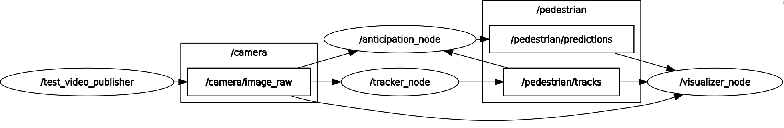

# End-to-End Pedestrian Behavior Prediction & Risk Estimation System Using VJEPA-2 Self-Supervised World Model

One of the few real-time (95+ fps), deployment-ready systems with near-state-of-the-art performance using a self-supervised transformer world model for 1–3s early pedestrian behavior prediction and probabilistic risk estimation, leveraging future latent prediction in a modular pipeline.

> Python, C++, PyTorch, OpenCV, ROS2, ONNX, TensorRT, FP16, NumPy, Matplotlib, Linux, Git, ViT, YOLO, MOT, monocular depth estimation, camera calibration, BEV projection.


## Paper

📄 **[Read the full paper](https://github.com/adityapatel149/pedestrian-action-anticipation-vjepa/blob/main/assets/main.pdf)**

## Demo

Examples showing **early anticipation of pedestrian crossing behavior**.

<table>
  <tr>
    <td align="center" width="100%">
      <video src="https://github.com/user-attachments/assets/5d03b4b3-d1fe-423a-a6a2-0481f20555b7" controls width="100%"></video>
      <br>
      <sub><b>Example 1:</b> Accurate anticipation in urban intersections</sub>
    </td>
  </tr>
  <tr>
    <td align="center" width="100%">
      <video src="https://github.com/user-attachments/assets/6eb65479-0e8c-42a3-9393-c47811f41417" controls width="100%"></video>
      <br>
      <sub><b>Example 2:</b> Precise prediction of pedestrian intent prior to any observable motion cues</sub>
    </td>
  </tr>
  <tr>
    <td align="center" width="100%">
      <video src="https://github.com/user-attachments/assets/1d7e777e-6f92-40cc-907a-4d5c6798de2c" controls width="100%"></video>
      <br>
      <sub><b>Example 3:</b> Robust and generalizable pedestrian intent prediction under complex and dynamic traffic conditions</sub>
    </td>
  </tr>
  <tr>
    <td align="center" width="100%">
      <video src="https://github.com/user-attachments/assets/4ac37f21-d87e-4f73-9ee5-265817a0004d" controls width="100%"></video>
      <br>
      <sub><b>Example 4:</b> Consistent and reliable crossing anticipation in diverse environments</sub>
    </td>
  </tr>
</table>

> **Note:** GitHub README does not reliably support `autoplay` for embedded videos, so viewers will usually need to press play manually.


## ROS2 Modular Node Graph

<p align="center">

</p>

---
## TLDR
#### **End-to-End Pedestrian Behavior Prediction & Risk Estimation System**

- Built a real-time, latency-critical autonomous perception system predicting pedestrian crossing behavior 1–3s ahead by training **(ViT-L) self-supervised world model + multi-task attention head**, achieving **0.92 AUC/0.86 bAacc/0.82 mAP** score on PIE benchmark that leverages predicted future latent representations for decision making.  
- Designed and processed **large-scale video datasets** (JAAD, PIE; **900K+ frames**) using **Python, OpenCV, NumPy**, and **PyTorch**, including data cleaning, temporal clip sampling (0.5s windows @15 FPS), **annotation alignment**, bbox encoding, and data-centric pipeline design for robust training and evaluation. 
- Engineered a production-grade, asynchronous pipeline (**Python + C++/ROS2**) with modular nodes for YOLO-based detection (**TensorRT**), multi-object tracking (**MOT**), anticipation, **depth estimation,** and **BEV** visualization, leveraging pipeline parallelism and memory-efficient streaming for real-time multi-pedestrian reasoning. 
- Developed depth-aware BEV projection using **monocular depth + camera calibration** (intrinsics/extrinsics) for **3D geometric reasoning** and designed a **probabilistic risk scoring algorithm** combining intent probability, distance-to-ego vehicle, and temporal consistency for real-time hazard prioritization. 
- Achieved **95+ FPS** on NVIDIA L4 GPU (**≈10× speedup from ~10 FPS PyTorch**) via **ONNX → TensorRT** conversion, **quantization (FP16)**, model compression, and **profiling**, demonstrating deployment-aware ML design; evaluated using AUROC, mAP, F1, and temporal stability metrics, with performance competitive with **state-of-the-art models under real-time constraints**.


## Overview

**Objective**: Predicting pedestrian crossing behavior **before it happens**.

This project presents a real-time, end-to-end pedestrian behavior prediction and risk estimation system built on top of V-JEPA2, a self-supervised world model for video understanding.

The system anticipates pedestrian crossing behavior 1–3 seconds before it occurs using partial video observations (~0.5 seconds), enabling safer and more proactive decision-making in autonomous driving systems.

Unlike traditional approaches that rely heavily on supervised learning and reactive pipelines, this system leverages world-model-based representations to reason about future states. It integrates perception, temporal reasoning, geometric understanding, and decision-aware risk estimation into a unified, production-grade pipeline.

Key components include:

- Object detection (YOLO, TensorRT)
- Multi-object tracking (MOT)
- Self-supervised world model (V-JEPA2, ViT-L)
- Future latent prediction
- Depth estimation and camera calibration
- Bird’s Eye View (BEV) projection
- Probabilistic risk scoring

The system is deployed using a ROS2-based asynchronous architecture (Python + C++) and achieves 95+ FPS on an NVIDIA L4 GPU through ONNX conversion, TensorRT acceleration, and FP16 quantization.

### System Architecture

The system operates as a modular, asynchronous pipeline:

Video Input  
→ YOLO Detection (TensorRT)  
→ Multi-Object Tracking  
→ Temporal Clip Sampling (0.5s @ 15 FPS)  
→ V-JEPA2 Encoder (frozen)  
→ Future Latent Prediction  
→ Feature Fusion (context + future + bounding box embeddings)  
→ Multi-task Attention Head  (crossing, walking, intersection, signalized)
→ Camera Calibration (intrinsics/extrinsics)  
→ Depth Estimation  
→ BEV Projection  
→ Risk Scoring  

### Quick Start
To run inference on a video without annotations:

```bash
pip install -r requirements.txt
pip install -e .

python -m py_app.main `
    --config configs/inference/vitl/pie.yaml `
    --encoder-model path/to/your/engines/encoder.engine `
    --classifier-model path/to/your/engines/classifier_1.engine `
    --video path/to/your/test.mp4 `
    --detector-conf 0.3 `
    --max-boxes 10 `
    --detector engines/yolo26m.engine `
    --anticipation-time 1.0 `
    --use-depth --depth-model path/to/your/engines/da3-small.engine `
    --display --render-scale 0.5

```

To run using .pt files:

```bash
python -m py_app.main `
    --config configs/inference/vitl/pie.yaml `
    --classifier-model your_folder/evals/vitl/pie/action_anticipation_frozen/pie-vitl16/latest.pt `
    --sweep-idx 1 `
    --video path/to/your/test.mp4 `
    --detector-conf 0.3 `
    --max-boxes 10 `
    --detector engines/yolo26n.pt `
    --anticipation-time 1.0 `
    --display --render-scale 0.5
    --use-depth --depth-model path/to/your/engines/da3-small.engine `

```

To run test evaluation on PIE benchmark dataset:
```bash
pip install -r requirements.txt
python -m evals.main --fname configs/eval/vitl/pie.yaml --devices cuda:0

```

The configs allow to train multiple probes in parallel with various optimization parameters. Change filepaths as needed (e.g. folder, checkpoint, dataset_train, dataset_val) to match locations of data and the downloaded vitl.pt vjepa2 checkpoint on your local filesystem. Change # nodes and local batch size as needed to not exceed available GPU memory. Download the probe checkpoints, rename it to 'latest.pt', and create a folder with the checkpoint inside, with the format matching the variables in the config:

```bash
[folder]/[eval_name]/[tag]/latest.pt
```

Comment out the following code from evals/main.py if **NOT** running locally on a Windows machine with single GPU:

```bash

    import torch.distributed as dist
    import tempfile

    temp_dir = tempfile.gettempdir()
    init_file = os.path.join(temp_dir, "shared_init_file")

    dist.init_process_group(
        backend="gloo",  # use 'nccl' only if running on GPU with compatible setup
        init_method=f"file://{init_file}",
        rank=0,
        world_size=1
    )

```


---

## Research Motivation

Pedestrian intent is expressed through subtle cues such as head orientation, motion patterns, proximity to crosswalks, and scene context.

Traditional approaches rely entirely on large-scale manual annotations or on complex pipelines (pose estimation → vehicle odometer data → trajectory models → rule engines).
By leveraging **self-supervised video representation learning**, this work investigates how well self-supervised world models trained on massive datasets can capture pedestrian intent, motion cues, and scene context.

---

## Model Architecture

<p align="center">

</p>

Pipeline:

1. Extract video clips containing pedestrians  
2. Encode frames with **frozen V-JEPA2 encoder**  
3. Predict **future latent scene tokens** using the predictor  
4. Combine context tokens and predicted future tokens  
5. Augment features using **pedestrian bounding box embeddings**  
6. Train a lightweight **attention probe network** for prediction  

### Backbone: V-JEPA2 World Model

- Vision Transformer architecture (ViT-L/16)  
- Trained using **self-supervised predictive learning**  
- Learns structured representations of **scene dynamics and motion**
-  Predict future tokens in latent space
-  Performs classification and reasoning on enriched representations

The backbone remains **frozen**, acting as a general-purpose video world model. This enables anticipation of pedestrian behavior before explicit motion cues appear.


### Multi-Task Prediction Head

The probe predicts multiple attributes simultaneously.

Q1 – Crossing prediction  
Q2 – Walking vs standing  
Q3 – Intersection context  
Q4 – Traffic signal state  

Multi-task supervision encourages richer representations of pedestrian behavior. This results in a unified representation that captures both scene structure and motion dynamics.

### Loss Optimization
The model uses a focal loss and alpha = 0.25 & gamma = 2.0, to handle **severe class imbalance** on crossing prediction. 
The loss weights down auxiliary tasks to allow model to focus on the primary crossing task while learning relevant attention cues from auxiliary tasks.

### From Prediction to Risk Estimation

The system extends beyond classification by computing a probabilistic risk score:

Risk = f(intent probability, distance to ego vehicle, relative position to ego-vehicle)

This enables prioritization of hazards and supports downstream decision-making.


### Why This Approach Works

Traditional models learn from labeled data only. V-JEPA2 learns from **massive unlabeled video**, capturing:
- motion dynamics  
- human behavior patterns  
- scene structure  

This enables:

- Better generalization across environments  
- Robustness to occlusion and lighting

---

## Datasets

To improve robustness, we applied data augmentations during training. These augmentations help the model generalize to variations in scale, occlusion, and scene appearance. We used RandAugment to introduce diverse appearance transformations, random resized cropping to handle scale variations, random horizontal flipping, and random erasing to simulate partial occlusions. 

### JAAD

JAAD is a dataset for studying joint attention in the context of autonomous driving. The focus is on pedestrian and driver behaviors at the point of crossing and factors that influence them. To this end, JAAD dataset provides a richly annotated collection of 346 short video clips (5-10 sec long) extracted from over 240 hours of driving footage. 

| Metric                                              | Value    |
|----------------------------------------------------|----------|
| Total number of frames                             | 82,032   |
| Total number of annotated frames                   | 82,032   |
| Number of pedestrians with behavior annotations    | 686      |
| Total number of pedestrians                        | 2,786    |
| Number of pedestrian bounding boxes                | 378,643  |
| Average length of pedestrian track (frames)        | 121      |
| Number of pedestrians who cross the street         | 495      |
| Number of pedestrians who do not cross the street  | 191      |

### PIE

PIE is a new dataset for studying pedestrian behavior in traffic. PIE contains over 6 hours of footage recorded in typical traffic scenes with on-board camera. It also provides accurate vehicle information from OBD sensor (vehicle speed, heading direction and GPS coordinates) synchronized with video footage.

| Metric                                             | Value    |
|---------------------------------------------------|----------|
| Total number of frames                            | 909,480  |
| Total number of annotated frames                  | 293,437  |
| Number of pedestrians with behavior annotations   | 1,842    |
| Number of pedestrian bounding boxes               | 738,970  |
| Number of traffic object bounding boxes           | 2,353,983|
| Average length of pedestrian track (frames)       | 401      |
| Intend to cross and cross                        | 519      |
| Intend to cross and don't cross                  | 894      |
| Do not intend to cross                           | 429      |

---

## Data Pipeline

<p align="center">

</p>

Clip sampling:

-   8 frames per clip
-   15 FPS
-   Approximately 0.5 second observation window
-   30 percent overlap

Prediction target:

-   Will the pedestrian cross within the next 1-3 seconds?


---

## Training Configuration

Backbone: V-JEPA2 ViT-L  
Frames per clip: 8  
Frames per second: 15
Resolution: 256×256  
Batch size: 32
Optimizer: AdamW  
Loss: Softmax Focal Loss  

---

## Evaluation Framework

<p align="center">

</p>

Sample
Sample level metrics:

-   Accuracy
-   Balanced accuracy
-   Precision
-   F1 score
-   AUROC
-   mAP

Instance level metrics:

-   Soft aggregation
-   Hard agreement

Confidence stability:

Delta confidence is the absolute difference between consecutive probabilities.

---

## Results

### Core Performance on PIE test split


| Model        | Input     | mAP | bAcc | AUC | Acc | Prec | F1  | Soft bAcc | Hard bAcc | Soft Acc | Hard Acc | Soft Prec | Hard Prec | Soft F1 | Hard F1 | confΔ max | confΔ avg |
|-------------|-----------|-----|------|-----|-----|------|-----|-----------|-----------|----------|----------|-----------|-----------|---------|---------|------------|------------|
| SFGRU       | I,B,E     | 0.75| 0.75 | 0.87| 0.83| 0.79 | 0.65| 0.76      | 0.61      | 0.85     | 0.72     | 0.87      | 0.50      | 0.67    | 0.43    | **0.10**   | _0.04_     |
| PCPA        | I,B,E,P   | 0.79| 0.81 | 0.89| 0.86| 0.81 | 0.74| 0.81      | 0.63      | 0.88     | 0.72     | **0.90**  | 0.50      | 0.76    | 0.46    | 0.17       | 0.07       |
| BiPed       | I,B,E     | 0.84| 0.84 | _0.93_| **0.89**| 0.84 | **0.79**| _0.86_    | 0.66      | _0.90_   | 0.74     | **0.90**  | 0.56      | **0.82**| 0.51    | 0.16       | 0.06       |
| PedFormer   | I,B,E     | **0.88**| _0.85_| **0.94**| **0.89**| **0.85**| **0.79**| _0.86_    | _0.76_    | **0.91** | **0.80** | _0.89_    | **0.66**  | **0.82**| _0.65_  | _0.12_     | _0.04_     |
| Ours (Cross)| I,B       | 0.80| **0.86**| 0.92| _0.87_| 0.71 | _0.77_| **0.87**  | _0.76_    | 0.89     | 0.77     | 0.75      | 0.56      | _0.80_  | 0.64    | 0.37       | 0.05       |
| Ours (Multi)| I,B       | _0.86_| **0.86**| _0.93_| 0.85| 0.67 | 0.76| _0.86_    | **0.80** | 0.86     | _0.79_    | 0.70      | _0.59_    | 0.77    | **0.68**| **0.10**   | **0.02**   |
> Experiment results for action prediction on PIE. Input abbreviations: I: RGB Image, B: BoundingBox, E: Ego-Vehicle motion, P: Pose


### Strengths of Each Sweep

| Model        | mAP   | bAcc  | AUC   | Acc  | Prec | F1   | soft_F1 / hard_F1 | conf∆ max/avg |
|-------------|-------|-------|-------|------|------|------|-------------------|--------------|
| Ours (Sweep 0) | 0.799 | **0.860** | **0.922** | **0.866** | **0.706** | **0.771** | **0.799 / 0.637** | 0.366 / 0.054 |
| Ours (Sweep 1) | 0.796 | 0.848 | 0.914 | 0.850 | 0.674 | 0.750 | 0.759 / **0.648** | **0.147 / 0.038** |
| Ours (Sweep 2) | **0.825** | 0.850 | 0.918 | 0.855 | 0.687 | 0.755 | 0.786 / 0.638 | 0.159 / **0.035** |
> Note: The sweeps correspond to parameter sweeps where the model was trained with different learning rates.


**Sweep 0 (Best Overall Performance)**

-   Highest AUC, accuracy, and F1 score
-   Strongest performance across soft metrics
-   Best general-purpose model for prediction quality

**Sweep 1 (Most Stable and Conservative)**

-   Best performance on all hard metrics
-   Lowest conf_delta_max indicating stable predictions
-   More conservative behavior under strict evaluation

**Sweep 2 (Best Ranking and Temporal Smoothness)**

-   Highest mAP (best ranking performance)
-   Lowest conf_delta_avg indicating smooth temporal predictions
-   Good balance between performance and stability


### Which Sweep to Use

-   Use Sweep 0 for best overall performance
-   Use Sweep 1 for more stable and conservative predictions
-   Use Sweep 2 for smoother temporal predictions and better ranking

### Inference Usage

You can select the sweep during inference using:
```bash
    --sweep-idx 0   # Best overall performance
    --sweep-idx 1   # More stable / conservative predictions
    --sweep-idx 2   # Smoother temporal predictions
```
Example:
```bash
    python video_inference.py \
      --config configs/inference/vitl/pie.yaml \
      --classifier-model path/to/checkpoint.pt \
      --video path/to/video.mp4 \
      --sweep-idx 0
```

### Key Observations

- Model successfully anticipates crossing **up to 3 seconds before event**  
- Strong performance despite **class imbalance and subtle behavioral cues**  
- Multi-task supervision improves representation quality  

### Why This Matters

Early prediction is critical for:

• collision avoidance  
• safe braking decisions  
• real-time planning systems  

These results show that **world-model-based representations transfer effectively to autonomous driving tasks**.

---

## Visualization

### Attention Heatmaps
The probe attends to:
- pedestrians 
- possible regions for more pedestrians
- crosswalk regions  
- traffic signals  
- possible regions for more signs/traffic signals. (Looking at the top of street pole)

The attention maps show that, across all 7 context frames, the probe consistently focuses on semantically meaningful spatial regions corresponding to pedestrians, crosswalk areas, traffic signals, and other relevant street-scene cues. The attended regions align with the locations of visible pedestrians and traffic infrastructure, while also highlighting nearby candidate areas where additional pedestrians or signals may appear, such as crosswalk entrances and the upper parts of street poles. This suggests that the model is not attending randomly, but is tracking task-relevant regions over time in order to form its future-frame prediction in latent space.

Attention heatmap across frames and for "Future frame in latent space (predictor-output)" overlayed on last context frame:
<p align="center">

</p>


The intersection map, overlaid on the last context frame, may highlight regions that appear empty or irrelevant at that final timestep. However, these regions correspond to locations that were attended to in earlier frames, where pedestrians, crosswalks, traffic signals, or other relevant cues were present. Thus, the intersection captures temporally consistent areas of importance across all 7 frames, even if those regions are no longer occupied in the final frame. This indicates that the model maintains attention on semantically meaningful locations over time, rather than relying solely on instantaneous visual content.

Intersection of attention regions overlayed on last context frame:
<p align="center">

</p>


### Anticipation Performance

<p align="center">

</p>

Performance is evaluated against **Time-To-Event (TTE)**.

We observe a decrement across all metrics with increase in anticipation time / time-to-event.

---------------------------------------------------------------------

## Failure Case Analysis

Understanding failure scenarios is critical for safe autonomous systems.
Common failure modes observed:

- **Heavy occlusion** : Pedestrians partially occluded by vehicles or scene elements reduce visibility of key motion cues, leading to uncertain or delayed predictions.
- **Group interactions** : Multi-agent scenarios introduce complex social dynamics, where individual intent becomes harder to isolate from group behavior.
- **Ambiguous body language** : Subtle or hesitant movements near the curb make intent difficult to infer, especially when clear motion signals are absent.
- **Implicit vehicle-motion bias** : The model exhibits a correlation between ego-vehicle motion and predicted pedestrian intent. When the vehicle is moving, predictions are biased toward *not crossing*, whereas stationary scenes increase *crossing* predictions. This likely arises from dataset priors where vehicle motion correlates with pedestrian behavior.

In real-world driving data, vehicle motion and pedestrian actions are tightly coupled. Vehicles slow down or stop because pedestrians are about to cross, and pedestrians often delay crossing because vehicles are moving. As a result, both signals co-occur and are highly predictive of each other. During training, the model learns these correlations as predictive features, but they do not encode a clear direction of causality. This leads to a form of causal ambiguity, where the model may rely on vehicle motion as a proxy for pedestrian behavior, even though it is not the underlying cause.

This reflects the model’s ability to capture contextual priors present in real-world driving data, where pedestrian actions are influenced by traffic flow. However, this can blur the distinction between intent (what the pedestrian plans to do) and action (what is immediately likely given the current scene constraints), and produce incorrect predictions.

The system identifies a key limitation in real-world data:

- Vehicle motion is strongly correlated with pedestrian behavior
- Models may learn proxy signals rather than causal relationships

This highlights the importance of understanding dataset bias and causal ambiguity in autonomous systems.
  
---

## Tech Stack

**Tools & Libraries**
- Python, C++, ROS2
- PyTorch, OpenCV, NumPy, Matplotlib
- OONX, TensorRT
- Git, Linux

**Machine Learning & Computer Vision**
- PyTorch
- Vision Transformers (ViT-L), V-JEPA2 (Self-Supervised World Models)
- Multi-Task Learning, Attention Mechanisms
- Temporal Video Understanding / Spatiotemporal Modeling
- Object Detection (YOLO), Multi-Object Tracking (MOT)
- Monocular Depth Estimation

**Data Engineering & Processing**
- Large-scale video data pipelines (JAAD, PIE; 100K+ frames)
- Frame extraction, temporal clip sampling (0.5s @ 15 FPS)
- Annotation alignment, bounding box encoding
- Data cleaning, preprocessing, and dataset curation
- OpenCV, NumPy for efficient video and image processing

**3D Vision & Geometry**
- Camera calibration (intrinsics & extrinsics)
- 3D geometric reasoning and projection (image → world / BEV)
- Depth-aware Bird’s Eye View (BEV) generation
- Metric distance estimation from monocular inputs

**Systems & Robotics**
- ROS2 (C++) modular node-based architecture
- Real-time perception pipelines
- Multi-node distributed system design
- Asynchronous processing and pipeline parallelism

**Deployment & Optimization**
- ONNX export and model conversion
- TensorRT inference acceleration
- Quantization (FP16), model compression
- CUDA acceleration and GPU profiling
- Latency-critical system design (95+ FPS real-time inference)

---

## Key Skills Demonstrated
**Research & Experimentation**
- Adapting state-of-the-art research (V-JEPA2) to real-world systems
- Designing reproducible ML experiments and ablations
- Benchmarking against state-of-the-art models
- Failure case analysis and model interpretability

**Machine Learning Engineering**
- End-to-end ML system design (data → model → deployment)
- Temporal deep learning for video understanding
- Multi-task learning for behavior prediction
- Self-supervised representation learning (world models)
- Model evaluation using AUROC, mAP, F1, and temporal stability metrics

**Computer Vision & Autonomous Driving**
- Pedestrian intent prediction and risk estimation
- Multi-object detection and tracking (MOT)
- Depth estimation and 3D scene understanding
- Bird’s Eye View (BEV) projection and spatial reasoning
- Real-time perception for autonomous systems

**Software & Systems Engineering**
- Production-grade pipeline development (Python + C++ + ROS2)
- Modular system design using ROS2 nodes
- Asynchronous pipelines and memory-efficient data streaming
- Real-time system optimization (latency vs throughput trade-offs)

**Deployment & Optimization**
- Model optimization for real-time inference (ONNX, TensorRT)
- Quantization and model compression techniques
- GPU acceleration and performance profiling
- Deployment-aware ML system design

**Data Engineering**
- Large-scale video data processing and pipeline design
- Dataset curation, cleaning, and annotation alignment
- Efficient preprocessing using OpenCV and NumPy
- Handling class imbalance and temporal labeling


---

## Repository Structure
```bash
pedestrian-action-anticipation-vjepa/
├── assets/                         # Figures and visual assets used in the README
├── configs/                        # Evaluation and inference configs
│   ├── eval/vitl/
│   └── inference/vitl/
├── evals/                          # Task-specific evaluation code
│   ├── action_anticipation_frozen/
│   ├── hub/
│   ├── main.py
│   └── scaffold.py
├── py_app/                         # Python application for inference/runtime pipeline
│   ├── core/
│   ├── runners/
│   ├── tracking/
│   ├── visualization/
│   ├── __init__.py
│   ├── cli.py
│   └── main.py
├── ros2_ws/                        # ROS2 workspace for modular deployment
│   ├── src/
│   │   ├── pedestrian_anticipation_cpp/
│   │   ├── pedestrian_interfaces/
│   │   ├── pedestrian_tracker_cpp/
│   │   └── pedestrian_visualizer_cpp/
│   ├── rosgraph.png
│   └── test_image_publisher.py
├── src/                            # Core model, dataset, mask, and utility code
│   ├── datasets/
│   ├── hub/
│   ├── masks/
│   ├── models/
│   └── utils/
├── your_data/                      # JAAD / PIE splits and bbox annotation CSVs
│   └── *.csv
├── .gitignore
├── README.md
├── pyproject.toml
└── requirements.txt

```
---

## Future Work

- ✅ Optimizing inference performance
- ✅ Real-time deployment for autonomous vehicles 
- Fine-tuning the V-JEPA2 backbone
- Longer context 
- Multi-modal fusion with LiDAR and map data  
- Pedestrian trajectory prediction

---
## Acknowledgment

This project builds upon and adapts Meta AI’s V-JEPA2 world model, leveraging their official research and implementation:

https://github.com/facebookresearch/vjepa2

This project builds upon the evaluation framework and benchmark introduced in [*Diving Deeper Into Pedestrian Behavior Understanding: Intention Estimation, Action Prediction, and Event Risk Assessment*](https://arxiv.org/abs/2407.00446), which provides a comprehensive analysis of pedestrian behavior understanding across multiple tasks, including intention estimation, action prediction, and event risk assessment.

---
## Author

Aditya Sanjaykumar Patel

MS Computer Science  
San Jose State University

Machine Learning Engineer focused on:

- autonomous driving AI  
- video understanding  
- world models  
- computer vision

LinkedIn: https://www.linkedin.com/in/adityapatel149

Portfolio: https://adityapatel149.github.io

Email: imadityapatel149@gmail.com
